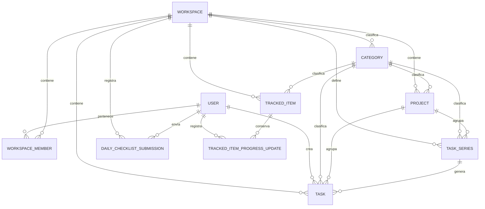

# ERD de LifeManager

## Modelo objetivo de la Versión 1

El diagrama detallado del dominio de planificación y seguimiento se encuentra en:

```text
docs/database/V1-Target-Data-Model.md
```

Resumen conceptual:



`Task` representa tanto Tareas manuales como ocurrencias generadas. `TaskSeries` siempre define una recurrencia finita mediante `start_date` y `end_date` obligatorias.
