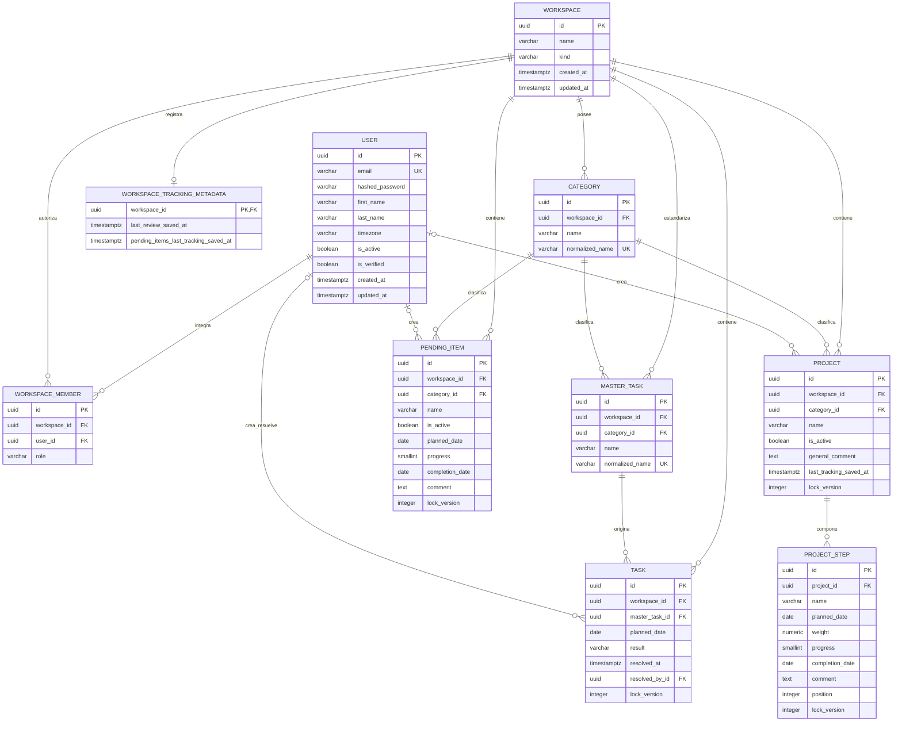

# ERD objetivo de LifeManager V1 — Personal Workspace

> **ERD V1 ACTUAL.** No representa responsables, Workspaces compartidos, Actividades, historia ni otros requisitos V2. El ERD V2 aún no ha sido diseñado.

Este diagrama representa el modelo físico aprobado en `docs/database/V1-Target-Data-Model.md`. El ERD anterior permanece únicamente dentro de `docs/database/Legacy-V1-Target-Data-Model.md`.

```mermaid
erDiagram
    USER ||--o{ WORKSPACE_MEMBER : integra
    WORKSPACE ||--o{ WORKSPACE_MEMBER : autoriza
    WORKSPACE ||--o| WORKSPACE_TRACKING_METADATA : registra
    WORKSPACE ||--o{ CATEGORY : posee
    WORKSPACE ||--o{ MASTER_TASK : estandariza
    WORKSPACE ||--o{ TASK : contiene
    WORKSPACE ||--o{ PENDING_ITEM : contiene
    WORKSPACE ||--o{ PROJECT : contiene
    CATEGORY ||--o{ MASTER_TASK : clasifica
    CATEGORY ||--o{ PENDING_ITEM : clasifica
    CATEGORY ||--o{ PROJECT : clasifica
    MASTER_TASK ||--o{ TASK : origina
    PROJECT ||--o{ PROJECT_STEP : compone
    USER o|--o{ TASK : crea_resuelve
    USER o|--o{ PENDING_ITEM : crea
    USER o|--o{ PROJECT : crea

    USER {
        uuid id PK
        varchar email UK
        varchar hashed_password
        varchar first_name
        varchar last_name
        varchar timezone
        boolean is_active
        boolean is_verified
        timestamptz created_at
        timestamptz updated_at
    }
    WORKSPACE {
        uuid id PK
        varchar name
        varchar kind
        timestamptz created_at
        timestamptz updated_at
    }
    WORKSPACE_MEMBER {
        uuid id PK
        uuid workspace_id FK
        uuid user_id FK
        varchar role
    }
    WORKSPACE_TRACKING_METADATA {
        uuid workspace_id PK,FK
        timestamptz last_review_saved_at
        timestamptz pending_items_last_tracking_saved_at
    }
    CATEGORY {
        uuid id PK
        uuid workspace_id FK
        varchar name
        varchar normalized_name UK
    }
    MASTER_TASK {
        uuid id PK
        uuid workspace_id FK
        uuid category_id FK
        varchar name
        varchar normalized_name UK
    }
    TASK {
        uuid id PK
        uuid workspace_id FK
        uuid master_task_id FK
        date planned_date
        varchar result
        timestamptz resolved_at
        uuid resolved_by_id FK
        integer lock_version
    }
    PENDING_ITEM {
        uuid id PK
        uuid workspace_id FK
        uuid category_id FK
        varchar name
        boolean is_active
        date planned_date
        smallint progress
        date completion_date
        text comment
        integer lock_version
    }
    PROJECT {
        uuid id PK
        uuid workspace_id FK
        uuid category_id FK
        varchar name
        boolean is_active
        text general_comment
        timestamptz last_tracking_saved_at
        integer lock_version
    }
    PROJECT_STEP {
        uuid id PK
        uuid project_id FK
        varchar name
        date planned_date
        numeric weight
        smallint progress
        date completion_date
        text comment
        integer position
        integer lock_version
    }
```

No existe relación Task–Project ni entidad de recurrencia. ProjectStep pertenece exclusivamente a Project. Task hereda su Categoría mediante MasterTask.
