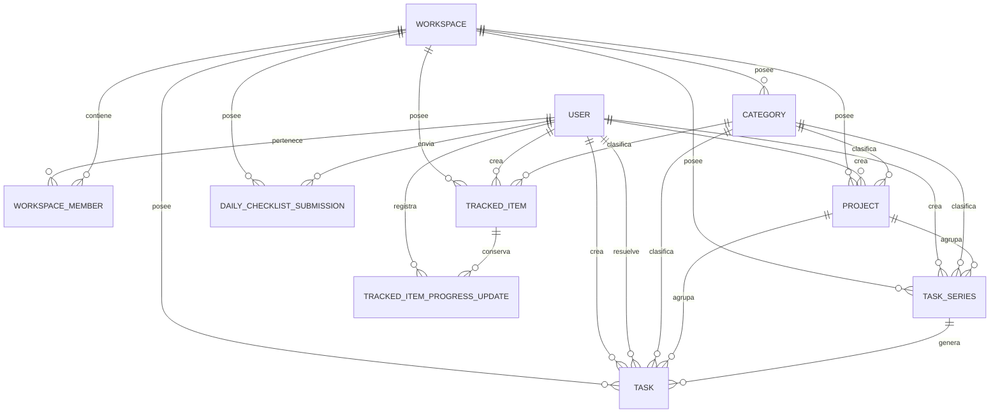

# Modelo de datos objetivo de LifeManager V1

## 1. Resumen ejecutivo

Este documento define el modelo objetivo de datos para los dominios de Planificación, Seguimiento y Reportes de LifeManager Versión 1.

Las entidades nuevas serán:

- `Category`;
- `Project`;
- `TaskSeries`;
- `Task`;
- `DailyChecklistSubmission`;
- `TrackedItem`;
- `TrackedItemProgressUpdate`.

El modelo se integra con `User`, `Workspace` y `WorkspaceMember`.

Toda Tarea será una ocurrencia individual. Una Tarea manual y una Tarea generada tendrán el mismo comportamiento y se almacenarán en la misma tabla `tasks`. Se distinguirán únicamente por su origen:

- Tarea manual: `task_series_id IS NULL`;
- Tarea generada: `task_series_id` referencia una `TaskSeries`.

No se crearán tablas separadas `TaskOccurrence`, `TaskResponse` ni `TaskTemplate`. El nombre técnico aprobado para una definición recurrente será `TaskSeries`.

Las recurrencias serán siempre finitas. Toda serie tendrá `start_date` y `end_date` obligatorias, y ninguna ocurrencia podrá generarse fuera de ese rango inclusivo.

Las Actividades con hora de inicio y fin quedan reservadas para Calendario en la Versión 2.

---

## 2. Principios transversales

1. Toda entidad de negocio pertenecerá a un workspace.
2. Las fechas de planificación serán `DATE`.
3. Los eventos de auditoría serán `TIMESTAMP WITH TIME ZONE`.
4. La fecha local efectiva se calculará con la zona horaria IANA del usuario autenticado.
5. No se añadirá una zona horaria al workspace en la Versión 1.
6. La pertenencia al mismo workspace se validará en services.
7. Se utilizarán claves foráneas UUID simples, no claves foráneas compuestas por `workspace_id`.
8. La base de datos protegerá integridad referencial; los services protegerán la coherencia entre workspaces y las reglas de operación.
9. El borrado del workspace eliminará sus datos de dominio mediante `ON DELETE CASCADE`.
10. El borrado físico de usuarios no eliminará registros históricos de negocio.

### Claves foráneas simples frente a claves compuestas

La Versión 1 utilizará claves foráneas simples porque mantienen el modelo y las relaciones de SQLAlchemy comprensibles. Una FK como `category_id -> categories.id` no demuestra por sí sola que la categoría y el recurso tengan el mismo `workspace_id`; esa regla deberá validarse en el service dentro de la misma transacción.

Las claves compuestas conscientes del workspace aportarían protección adicional, pero duplicarían `workspace_id` en restricciones, exigirían claves únicas auxiliares y aumentarían la complejidad del ORM. Podrán reconsiderarse si aparecen errores reales de aislamiento que justifiquen ese costo.

---

## 3. Catálogo de entidades

| Entidad | Tabla | Propósito |
|---|---|---|
| `User` | `users` | Cuenta autenticada, identidad y zona horaria. |
| `Workspace` | `workspaces` | Límite de propiedad y autorización. |
| `WorkspaceMember` | `workspace_members` | Membresía y rol de un usuario en un workspace. |
| `Category` | `categories` | Dato maestro reutilizable por los tres dominios. |
| `Project` | `projects` | Agrupador de Tareas con progreso calculado. |
| `TaskSeries` | `task_series` | Definición finita que genera Tareas individuales. |
| `Task` | `tasks` | Acción puntual para una fecha, manual o generada. |
| `DailyChecklistSubmission` | `daily_checklist_submissions` | Evidencia del envío de una revisión diaria. |
| `TrackedItem` | `tracked_items` | Asunto de larga duración con progreso porcentual. |
| `TrackedItemProgressUpdate` | `tracked_item_progress_updates` | Historial inmutable de progreso y comentarios. |

---

## 4. Diccionario de datos detallado

### 4.1 Category

#### Propósito

Dato maestro de clasificación aplicable indistintamente a Tareas, Pendientes y Proyectos. La Versión 1 no utilizará flags de aplicabilidad; una categoría podrá usarse en los tres dominios. Esta opción evita configuración prematura y permite añadir restricciones futuras sin cambiar las relaciones básicas.

#### Columnas

| Columna | Tipo PostgreSQL | Nulo | Default | Clave o restricción |
|---|---|---:|---|---|
| `id` | `UUID` | no | UUID4 en aplicación | PK |
| `workspace_id` | `UUID` | no | — | FK `workspaces.id`, `ON DELETE CASCADE` |
| `name` | `VARCHAR(100)` | no | — | Nombre visible |
| `normalized_name` | `VARCHAR(100)` | no | — | `UNIQUE (workspace_id, normalized_name)` |
| `description` | `VARCHAR(500)` | sí | `NULL` | — |
| `is_active` | `BOOLEAN` | no | `true` | — |
| `created_at` | `TIMESTAMPTZ` | no | `now()` | Auditoría |
| `updated_at` | `TIMESTAMPTZ` | no | `now()` | Auditoría |

`normalized_name` se almacenará para que la unicidad no dependa de la configuración regional de PostgreSQL. El service lo producirá mediante una normalización única y documentada.

#### Restricciones e índices

- Unique: `(workspace_id, normalized_name)`.
- Check: `length(trim(name)) > 0`.
- Índice de listado: `(workspace_id, is_active, name)`.

#### Relaciones y cardinalidades

- Un Workspace tiene cero o muchas Categorías.
- Una Categoría clasifica cero o muchos Proyectos, TaskSeries, Tareas y Pendientes.

#### Ciclo de vida y mutabilidad

- Se crea activa.
- Nombre, descripción y estado activo son editables desde Configuración.
- Una categoría referenciada no se elimina físicamente; se desactiva.
- `id`, `workspace_id` y `created_at` son inmutables.
- No tiene mutaciones desde Seguimiento.

#### API y reportes

- API de Configuración: lectura, creación, edición y activación/desactivación.
- `normalized_name` no se expone públicamente.
- Reportes pueden agrupar resultados históricos por categoría, incluso si está inactiva.

---

### 4.2 Project

#### Propósito

Agrupar Tareas relacionadas y presentar un progreso calculado a partir de ellas.

#### Columnas

| Columna | Tipo PostgreSQL | Nulo | Default | Clave o restricción |
|---|---|---:|---|---|
| `id` | `UUID` | no | UUID4 en aplicación | PK |
| `workspace_id` | `UUID` | no | — | FK `workspaces.id`, `ON DELETE CASCADE` |
| `created_by_id` | `UUID` | no | — | FK `users.id`, `ON DELETE RESTRICT` |
| `category_id` | `UUID` | sí | `NULL` | FK `categories.id`, `ON DELETE NO ACTION` |
| `name` | `VARCHAR(150)` | no | — | — |
| `description` | `TEXT` | sí | `NULL` | — |
| `start_date` | `DATE` | sí | `NULL` | — |
| `target_date` | `DATE` | no | — | — |
| `lifecycle` | `projectlifecycle` | no | `ACTIVE` | Enum |
| `created_at` | `TIMESTAMPTZ` | no | `now()` | Auditoría |
| `updated_at` | `TIMESTAMPTZ` | no | `now()` | Auditoría |

`start_date` será opcional. Un proyecto puede definirse inicialmente por un objetivo y una fecha objetivo sin que el usuario conozca una fecha formal de inicio.

#### Enum de ciclo de vida

- `ACTIVE`;
- `COMPLETED`;
- `CANCELLED`.

El ciclo de vida se almacena porque representa una decisión explícita del usuario, distinta del progreso calculado. No se añadirá un estado `INACTIVE`; `CANCELLED` cubre el cierre sin terminación y `COMPLETED` el cierre exitoso.

#### Restricciones e índices

- Check: `length(trim(name)) > 0`.
- Check: `start_date IS NULL OR target_date >= start_date`.
- Índice: `(workspace_id, lifecycle, target_date)`.
- Índice: `category_id`.

#### Relaciones y cardinalidades

- Un Workspace tiene cero o muchos Proyectos.
- Un Proyecto pertenece opcionalmente a una Categoría.
- Un Proyecto agrupa cero o muchas TaskSeries y Tareas.

#### Campos almacenados y calculados

Se almacena el ciclo de vida. No se almacena el progreso.

Se calculan:

- total de Tareas relevantes;
- Tareas completadas;
- porcentaje de progreso;
- Tareas pendientes o bloqueantes;
- desempeño respecto de `target_date`.

#### Ciclo de vida y mutabilidad

- `ACTIVE -> COMPLETED` o `ACTIVE -> CANCELLED`.
- V1 no requiere reabrir proyectos cerrados.
- Nombre, descripción, categoría, fechas y asociaciones son editables desde Planificación mientras esté activo.
- Seguimiento solo consulta progreso y Tareas relacionadas; no sobrescribe progreso.
- `id`, `workspace_id`, `created_by_id` y `created_at` son inmutables.

#### API y reportes

- Planificación expone creación, edición y cierre.
- Seguimiento expone progreso calculado y Tareas no resueltas.
- Reportes usan ciclo de vida, fechas y resultados de Tareas; no dependen de un porcentaje almacenado.

---

### 4.3 TaskSeries

#### Propósito

Definir una recurrencia finita y el contenido predeterminado de las Tareas que genera.

#### Columnas

| Columna | Tipo PostgreSQL | Nulo | Default | Clave o restricción |
|---|---|---:|---|---|
| `id` | `UUID` | no | UUID4 en aplicación | PK |
| `workspace_id` | `UUID` | no | — | FK `workspaces.id`, `ON DELETE CASCADE` |
| `created_by_id` | `UUID` | no | — | FK `users.id`, `ON DELETE RESTRICT` |
| `category_id` | `UUID` | sí | `NULL` | FK `categories.id`, `ON DELETE NO ACTION` |
| `project_id` | `UUID` | sí | `NULL` | FK `projects.id`, `ON DELETE NO ACTION` |
| `title` | `VARCHAR(255)` | no | — | Snapshot predeterminado |
| `description` | `TEXT` | sí | `NULL` | Snapshot predeterminado |
| `frequency` | `taskseriesfrequency` | no | — | Enum |
| `interval` | `INTEGER` | no | `1` | Check según frecuencia |
| `weekdays` | `SMALLINT[]` | sí | `NULL` | ISO 1=lunes a 7=domingo |
| `start_date` | `DATE` | no | — | Inicio inclusivo obligatorio |
| `end_date` | `DATE` | no | — | Fin inclusivo obligatorio |
| `is_active` | `BOOLEAN` | no | `true` | — |
| `created_at` | `TIMESTAMPTZ` | no | `now()` | Auditoría |
| `updated_at` | `TIMESTAMPTZ` | no | `now()` | Auditoría |

#### Representación de recurrencia

`frequency` tendrá:

- `DAILY`;
- `WEEKLY`;
- `MONTHLY`;
- `YEARLY`.

`interval` tendrá estas combinaciones en V1:

- `DAILY`, intervalo 1;
- `WEEKLY`, intervalo 1;
- `WEEKLY`, intervalo 2 para recurrencia quincenal;
- `MONTHLY`, intervalo 1;
- `YEARLY`, intervalo 1.

Los días seleccionados utilizarán `SMALLINT[]` con números ISO del 1 al 7. Esta opción es más simple que una tabla relacionada y más consultable y tipada que JSON. Un bitmask sería compacto, pero menos legible y más difícil de validar. El orden y la ausencia de duplicados se normalizarán en el service.

Para `WEEKLY`, `weekdays` será obligatorio y no vacío. Para las demás frecuencias será nulo. Una recurrencia semanal con un solo día representa “semanal”; varios días representan “días seleccionados”.

La recurrencia mensual utilizará el día de `start_date` como ancla. Cuando ese día no exista en un mes objetivo, se utilizará el último día calendario de ese mes sin cambiar el ancla original para los meses posteriores.

Ejemplo para un ancla del 31 de enero:

```text
31 de enero
28 o 29 de febrero
31 de marzo
30 de abril
```

La recurrencia anual utilizará el mes y día de `start_date` como ancla. Una serie anclada al 29 de febrero generará una ocurrencia el 28 de febrero durante años no bisiestos y volverá al 29 de febrero durante años bisiestos.

Todos los cálculos de recurrencia utilizarán aritmética de fechas de calendario. No se implementarán mediante duraciones fijas expresadas como cantidades de días.

#### Restricciones e índices

- Check: `end_date >= start_date`.
- Check: combinaciones de `frequency` e `interval` permitidas.
- Check: para `WEEKLY`, `weekdays` no nulo y `cardinality(weekdays) >= 1`.
- Check: para otras frecuencias, `weekdays IS NULL`.
- Check: todos los valores de `weekdays` están entre 1 y 7; la unicidad y orden se validan en service.
- Check: título no vacío.
- Índice: `(workspace_id, is_active, end_date)`.
- Índices: `category_id`, `project_id`.

No se permite `end_date` nulo, recurrencia infinita ni ocurrencias fuera del rango inclusivo.

#### Relaciones y cardinalidades

- Un Workspace tiene cero o muchas TaskSeries.
- Una TaskSeries pertenece opcionalmente a una Categoría y un Proyecto.
- Una TaskSeries puede generar cero o muchas Tareas.
- Toda Tarea generada referencia exactamente una TaskSeries.
- Una Tarea manual no referencia ninguna TaskSeries.

#### Snapshots de ocurrencias

Al generar una Tarea se copiarán `title`, `description`, `category_id` y `project_id`. La Tarea será un snapshot independiente. Modificar la TaskSeries no cambiará Tareas históricas ni resueltas.

#### Reglas de edición

- Editar metadata de la serie cambia sus valores predeterminados, no las Tareas ya generadas.
- Extender `end_date` genera las nuevas ocurrencias comprendidas en la extensión.
- Acortar `end_date` elimina únicamente ocurrencias futuras no resueltas fuera del nuevo rango. Se rechazará si existe una ocurrencia resuelta fuera del rango propuesto.
- Desactivar la serie impide nueva generación; no elimina Tareas existentes.
- Editar una ocurrencia modifica solo esa Tarea.
- “Esta y futuras” modifica snapshots de Tareas no resueltas desde una fecha efectiva, sin cambiar sus fechas planificadas.
- V1 no cambiará el patrón de fechas de una serie existente. Para otro patrón se desactiva la serie anterior y se crea una nueva.

#### Ciclo de vida y mutabilidad

- `start_date` y el patrón quedan inmutables después de generar ocurrencias.
- `end_date` solo cambia mediante extensión o acortamiento explícitos.
- Metadata, categoría y proyecto se editan desde Planificación.
- Seguimiento no modifica TaskSeries.

#### API y reportes

- Planificación expone creación, edición, extensión, acortamiento y desactivación.
- La definición completa no necesita aparecer en listas diarias.
- Reportes agrupan resultados por serie sin depender de la metadata actual para describir ocurrencias históricas.

---

### 4.4 Task

#### Propósito

Representar una acción puntual para una única fecha. Todas las Tareas son ocurrencias individuales, tanto manuales como generadas.

#### Columnas

| Columna | Tipo PostgreSQL | Nulo | Default | Clave o restricción |
|---|---|---:|---|---|
| `id` | `UUID` | no | UUID4 en aplicación | PK |
| `workspace_id` | `UUID` | no | — | FK `workspaces.id`, `ON DELETE CASCADE` |
| `created_by_id` | `UUID` | no | — | FK `users.id`, `ON DELETE RESTRICT` |
| `category_id` | `UUID` | sí | `NULL` | FK `categories.id`, `ON DELETE NO ACTION` |
| `project_id` | `UUID` | sí | `NULL` | FK `projects.id`, `ON DELETE NO ACTION` |
| `task_series_id` | `UUID` | sí | `NULL` | FK `task_series.id`, `ON DELETE NO ACTION` |
| `title` | `VARCHAR(255)` | no | — | — |
| `description` | `TEXT` | sí | `NULL` | — |
| `planned_date` | `DATE` | no | — | Fecha original |
| `resolution` | `taskresolution` | sí | `NULL` | Enum terminal |
| `resolved_at` | `TIMESTAMPTZ` | sí | `NULL` | Evento de resolución |
| `resolved_by_id` | `UUID` | sí | `NULL` | FK `users.id`, `ON DELETE RESTRICT` |
| `created_at` | `TIMESTAMPTZ` | no | `now()` | Auditoría |
| `updated_at` | `TIMESTAMPTZ` | no | `now()` | Auditoría |

El modelo objetivo no incluye prioridad, hora, duración, deadline datetime, porcentaje de progreso, archivo ni posición manual.

No se incluirá `resolved_in_submission_id` en V1. `resolved_at` y `resolved_by_id` permiten conocer cuándo y por quién se resolvió la Tarea, mientras `DailyChecklistSubmission` responde si la revisión fue enviada. Omitir la asociación evita una FK adicional y cualquier ciclo conceptual innecesario.

#### Restricciones e índices

- Unique parcial: `(task_series_id, planned_date) WHERE task_series_id IS NOT NULL`.
- Check: título no vacío.
- Check de resolución: los tres campos `resolution`, `resolved_at` y `resolved_by_id` son todos nulos o todos no nulos.
- Índice principal diario: `(workspace_id, planned_date, resolution)`.
- Índice: `(project_id, planned_date)`.
- Índices: `category_id`, `task_series_id`, `created_by_id`, `resolved_by_id`.

Las Tareas manuales pueden compartir fecha porque el unique parcial no incluye filas con `task_series_id IS NULL`.

Categoría, Proyecto y TaskSeries deberán pertenecer al mismo workspace; el service lo validará.

#### Estado almacenado y calculado

Se almacena únicamente `resolution`:

- `COMPLETED`;
- `NOT_COMPLETED`;
- `CANCELLED`.

Se calcula el estado público:

- con resolución: la resolución terminal;
- sin resolución y `planned_date` posterior a la fecha local: `SCHEDULED`;
- sin resolución y `planned_date` igual o anterior a la fecha local: `PENDING`.

#### Ciclo de vida y mutabilidad

- Una Tarea nace sin resolución.
- Planificación puede editar una Tarea futura y cancelarla.
- Cuando `planned_date <= fecha local efectiva`, la Tarea ha entrado en Seguimiento y `planned_date` queda inmutable.
- Seguimiento solo establece `COMPLETED` o `NOT_COMPLETED` y sus datos de resolución.
- Seguimiento nunca reprograma.
- Una Tarea no resuelta conserva su fecha y continúa apareciendo como pendiente.
- Una Tarea recurrente conserva snapshots del contenido de la serie.

Son siempre inmutables: `id`, `workspace_id`, `created_by_id`, `task_series_id` y `created_at`.

Son editables desde Planificación antes de Tracking: título, descripción, fecha planificada, categoría y proyecto. La cancelación es exclusiva de Planificación.

Desde Seguimiento solo se editan resolución, `resolved_at` y `resolved_by_id` mediante una operación de resolución.

#### API y reportes

- Planificación expone campos editables y el origen manual o recurrente.
- Seguimiento expone fecha original, estado calculado y operaciones terminales permitidas.
- `resolved_at` y `resolved_by_id` son de solo lectura.
- Reportes utilizan fecha original, resolución, fecha de resolución, categoría, proyecto y serie.

---

### 4.5 DailyChecklistSubmission

#### Propósito

Registrar que un usuario envió la revisión diaria de un workspace.

#### Columnas

| Columna | Tipo PostgreSQL | Nulo | Default | Clave o restricción |
|---|---|---:|---|---|
| `id` | `UUID` | no | UUID4 en aplicación | PK |
| `workspace_id` | `UUID` | no | — | FK `workspaces.id`, `ON DELETE CASCADE` |
| `user_id` | `UUID` | no | — | FK `users.id`, `ON DELETE RESTRICT` |
| `checklist_date` | `DATE` | no | — | Fecha local del usuario |
| `submitted_at` | `TIMESTAMPTZ` | no | `now()` | Evento de envío |
| `general_comment` | `TEXT` | sí | `NULL` | — |
| `created_at` | `TIMESTAMPTZ` | no | `now()` | Auditoría de inserción |

No tendrá `updated_at`: una entrega es un evento inmutable y no debe editarse.

#### Restricciones e índices

- Unique: `(workspace_id, user_id, checklist_date)`.
- Índice de reportes: `(user_id, checklist_date)`.
- El service valida que el usuario sea miembro del workspace.

#### Relaciones y cardinalidades

- Un Workspace tiene cero o muchas entregas.
- Un User tiene cero o muchas entregas.
- No existe FK directa desde Task en V1.

#### Ciclo de vida y mutabilidad

- Se inserta una sola vez por usuario, workspace y fecha.
- No se edita ni elimina mediante operaciones normales.
- Enviar la lista no exige resolver todas las Tareas.
- Las Tareas no resueltas continúan pendientes.
- Todos sus campos son inmutables después de creación.

#### API y reportes

- Seguimiento expone envío y consulta de estado de la revisión.
- Reportes miden cumplimiento y hora de envío.
- No representa el resultado de cada Tarea; ese resultado permanece en Task.

---

### 4.6 TrackedItem

#### Propósito

Representar un Pendiente seguido durante días o semanas mediante progreso porcentual y revisiones periódicas.

#### Columnas

| Columna | Tipo PostgreSQL | Nulo | Default | Clave o restricción |
|---|---|---:|---|---|
| `id` | `UUID` | no | UUID4 en aplicación | PK |
| `workspace_id` | `UUID` | no | — | FK `workspaces.id`, `ON DELETE CASCADE` |
| `created_by_id` | `UUID` | no | — | FK `users.id`, `ON DELETE RESTRICT` |
| `category_id` | `UUID` | sí | `NULL` | FK `categories.id`, `ON DELETE NO ACTION` |
| `title` | `VARCHAR(255)` | no | — | — |
| `description` | `TEXT` | sí | `NULL` | — |
| `is_active` | `BOOLEAN` | no | `true` | Ciclo de vida |
| `current_progress` | `SMALLINT` | no | `0` | Check 0–100 |
| `planned_finish_date` | `DATE` | no | — | — |
| `actual_finish_date` | `DATE` | sí | `NULL` | Gestionado por service |
| `created_at` | `TIMESTAMPTZ` | no | `now()` | Auditoría |
| `updated_at` | `TIMESTAMPTZ` | no | `now()` | Auditoría |

#### Restricciones e índices

- Check: `current_progress BETWEEN 0 AND 100`.
- Check: `current_progress = 100` si y solo si `actual_finish_date IS NOT NULL`.
- Check: título no vacío.
- Índice: `(workspace_id, is_active, planned_finish_date)`.
- Índice: `category_id`.

#### Estado y desempeño calculados

- 0: `NOT_STARTED`;
- 1–99: `IN_PROGRESS`;
- 100: `COMPLETED`.

Se calculan también: próximo a vencer, vencido, completado antes, a tiempo o tarde.

#### Regla de corrección de progreso

El Seguimiento semanal ordinario no podrá reducir el progreso. Una disminución será permitida únicamente mediante una operación explícita de corrección desde Planificación, con comentario obligatorio y registro histórico.

Si una corrección reduce un progreso de 100 a menos de 100, `actual_finish_date` volverá a `NULL`. Cuando alcance nuevamente 100, se asignará la nueva fecha efectiva. El historial conservará ambas decisiones.

#### Relaciones y cardinalidades

- Un Workspace tiene cero o muchos Pendientes.
- Un Pendiente pertenece opcionalmente a una Categoría.
- Un Pendiente tiene cero o muchas actualizaciones de progreso.

#### Ciclo de vida y mutabilidad

- Activo al crear; puede desactivarse y reactivarse desde Planificación.
- `id`, workspace, creador y fecha de creación son inmutables.
- Planificación edita título, descripción, categoría, fecha prevista y ciclo activo.
- Seguimiento añade avance no decreciente y comentarios.
- `current_progress` y `actual_finish_date` solo cambian junto con un registro histórico dentro de una transacción.

#### API y reportes

- API muestra progreso actual, estado y desempeño calculados.
- Planificación expone edición y corrección explícita.
- Seguimiento expone actualización semanal y comentario.
- Reportes usan fechas, historial, velocidad y desempeño.

---

### 4.7 TrackedItemProgressUpdate

#### Propósito

Conservar un historial append-only de cambios de progreso y comentarios periódicos.

#### Columnas

| Columna | Tipo PostgreSQL | Nulo | Default | Clave o restricción |
|---|---|---:|---|---|
| `id` | `UUID` | no | UUID4 en aplicación | PK |
| `tracked_item_id` | `UUID` | no | — | FK `tracked_items.id`, `ON DELETE CASCADE` |
| `recorded_by_id` | `UUID` | no | — | FK `users.id`, `ON DELETE RESTRICT` |
| `progress` | `SMALLINT` | no | — | Check 0–100 |
| `comment` | `TEXT` | sí | `NULL` | Obligatorio para corrección descendente |
| `recorded_at` | `TIMESTAMPTZ` | no | `now()` | Momento de negocio |
| `created_at` | `TIMESTAMPTZ` | no | `now()` | Momento de persistencia |

No tendrá `updated_at` porque sus registros serán inmutables.

#### Restricciones e índices

- Check: `progress BETWEEN 0 AND 100`.
- Índice: `(tracked_item_id, recorded_at, id)`.
- La regla de comentario obligatorio para disminuciones requiere conocer el valor anterior y se valida en service.

#### Reglas de historial y transacción

- El 0 inicial reside en `TrackedItem.current_progress`; no necesita una fila artificial.
- Todo cambio de porcentaje crea una fila.
- Se permiten actualizaciones semanales solo de comentario, repitiendo el porcentaje actual.
- Los registros no se editan ni eliminan por operaciones normales.
- Insertar la fila, actualizar `current_progress` y ajustar `actual_finish_date` ocurrirá en una misma transacción.
- El service bloqueará o controlará concurrencia para evitar que dos actualizaciones partan del mismo progreso obsoleto.

#### API y reportes

- API de Seguimiento crea actualizaciones y lista historia.
- No existe PATCH o DELETE ordinario para estas filas.
- Reportes calculan evolución, frecuencia de revisión, correcciones y velocidad.

---

## 5. Entidades existentes consideradas

### User

`User.timezone` define la fecha local efectiva de V1. Las FK de autoría, resolución, registro y envío usarán `ON DELETE RESTRICT`: para preservar historia, una cuenta con registros de negocio no deberá borrarse físicamente. La desactivación o anonimización futura es preferible.

### Workspace

Es propietario de todas las entidades de negocio. Sus FK directas utilizarán `ON DELETE CASCADE`. El borrado completo deberá probarse en PostgreSQL considerando las relaciones cruzadas `NO ACTION` y ejecutarse dentro de una transacción controlada.

### WorkspaceMember

Determina acceso y rol. Los services validarán membresía antes de operar y comprobarán que todas las referencias seleccionadas pertenezcan al mismo workspace.

---

## 6. Matriz de relaciones y cardinalidades

| Origen | Relación | Destino | Cardinalidad |
|---|---|---|---|
| User | membresías | WorkspaceMember | 1:N |
| Workspace | membresías | WorkspaceMember | 1:N |
| Workspace | categorías | Category | 1:N |
| Workspace | proyectos | Project | 1:N |
| Workspace | series | TaskSeries | 1:N |
| Workspace | tareas | Task | 1:N |
| Workspace | entregas diarias | DailyChecklistSubmission | 1:N |
| Workspace | pendientes | TrackedItem | 1:N |
| Category | proyectos | Project | 1:N opcional desde Project |
| Category | series | TaskSeries | 1:N opcional desde TaskSeries |
| Category | tareas | Task | 1:N opcional desde Task |
| Category | pendientes | TrackedItem | 1:N opcional desde TrackedItem |
| Project | series | TaskSeries | 1:N opcional desde TaskSeries |
| Project | tareas | Task | 1:N opcional desde Task |
| TaskSeries | ocurrencias | Task | 1:0..N; toda Tarea generada referencia una serie y una Tarea manual no referencia ninguna |
| User | tareas creadas | Task | 1:N |
| User | tareas resueltas | Task | 1:N opcional desde Task |
| User | entregas | DailyChecklistSubmission | 1:N |
| TrackedItem | actualizaciones | TrackedItemProgressUpdate | 1:N |
| User | actualizaciones registradas | TrackedItemProgressUpdate | 1:N |

---

## 7. Diagrama entidad-relación



---

## 8. Definiciones de enums

| Enum | Valores |
|---|---|
| `ProjectLifecycle` | `ACTIVE`, `COMPLETED`, `CANCELLED` |
| `TaskSeriesFrequency` | `DAILY`, `WEEKLY`, `MONTHLY`, `YEARLY` |
| `TaskResolution` | `COMPLETED`, `NOT_COMPLETED`, `CANCELLED` |

Estados calculados, no persistidos:

| Concepto | Valores calculados |
|---|---|
| Estado público de Task | `SCHEDULED`, `PENDING` o resolución terminal |
| Estado de TrackedItem | `NOT_STARTED`, `IN_PROGRESS`, `COMPLETED` |
| Desempeño de TrackedItem | due soon, overdue, completed early/on time/late |

---

## 9. Resumen de restricciones únicas y checks

| Tabla | Restricción |
|---|---|
| `categories` | Unique `(workspace_id, normalized_name)` |
| `projects` | Check `start_date IS NULL OR target_date >= start_date` |
| `task_series` | Check `end_date >= start_date`; patrón e intervalo válidos; weekdays válidos |
| `tasks` | Unique parcial `(task_series_id, planned_date)` para series; consistencia de resolución |
| `daily_checklist_submissions` | Unique `(workspace_id, user_id, checklist_date)` |
| `tracked_items` | Check progreso 0–100 y consistencia de fecha real |
| `tracked_item_progress_updates` | Check progreso 0–100 |

---

## 10. Estrategia de índices

Los índices se orientarán a consultas reales de V1:

- categorías activas por workspace;
- proyectos por ciclo y fecha objetivo;
- series activas que terminan en un rango;
- Tareas diarias, pendientes y resueltas por workspace y fecha;
- Tareas por Proyecto y fecha;
- una entrega diaria por usuario y fecha;
- Pendientes activos por fecha planificada;
- historial de progreso en orden estable.

No se indexarán campos de texto o cada FK automáticamente sin una consulta prevista. Los unique constraints crearán sus índices correspondientes.

---

## 11. Comportamiento de borrado

| Relación | Comportamiento |
|---|---|
| Workspace → entidades de dominio | `CASCADE` |
| User → autoría/historial | `RESTRICT` |
| Category → recursos usados | `NO ACTION`; desactivar categoría |
| Project → TaskSeries/Task | `NO ACTION`; cerrar proyecto |
| TaskSeries → Task | `NO ACTION`; desactivar serie |
| TrackedItem → ProgressUpdate | `CASCADE` para limpieza del workspace; el service no borra Pendientes usados |

`SET NULL` no se utilizará para autoría, resolución o historial porque perdería atribución. `RESTRICT` preserva integridad y obliga a desactivar o anonimizar usuarios en lugar de borrarlos.

---

## 12. Campos almacenados frente a calculados

| Entidad | Almacenados relevantes | Calculados |
|---|---|---|
| Category | nombre, nombre normalizado, activo | uso por dominio |
| Project | metadata, fechas, lifecycle | progreso y desempeño |
| TaskSeries | patrón, rango finito, defaults | fechas candidatas y métricas de serie |
| Task | fecha, snapshots, resolución | estado público y atraso |
| DailyChecklistSubmission | fecha y timestamp de entrega | envío oportuno, rachas |
| TrackedItem | progreso actual y fechas | estado y desempeño |
| ProgressUpdate | snapshot de progreso/comentario | delta y velocidad |

---

## 13. Matriz de mutación: Planificación y Seguimiento

| Entidad/acción | Planificación | Seguimiento |
|---|---:|---:|
| Crear/editar Category | sí, desde Configuración | no |
| Crear/editar/cerrar Project | sí | no |
| Consultar progreso de Project | sí | sí |
| Crear/editar/desactivar TaskSeries | sí | no |
| Crear Tarea manual | sí | no |
| Editar Tarea futura | sí | no |
| Cambiar `planned_date` de Tarea en seguimiento | no | no |
| Cancelar Tarea | sí | no |
| Resolver `COMPLETED`/`NOT_COMPLETED` | no | sí |
| Enviar lista diaria | no | sí |
| Crear/editar/desactivar TrackedItem | sí | no |
| Corrección descendente de progreso | sí, explícita | no |
| Progreso semanal no decreciente/comentario | no | sí |
| Editar ProgressUpdate histórico | no | no |

---

## 14. Generación de recurrencias

### Alternativas

#### Generación inmediata completa

Genera todas las ocurrencias del rango al crear o extender la serie. Es determinista, no requiere worker y permite reportes y edición explícita de fechas futuras.

#### Ventanas móviles

Reduce inserciones iniciales, pero necesita un proceso periódico que el proyecto todavía no tiene y complica la garantía de cobertura.

#### Generación bajo demanda

Evita filas anticipadas, pero mezcla lectura con materialización, dificulta reportes futuros y aumenta riesgos de concurrencia.

### Decisión V1

V1 generará inmediatamente todas las ocurrencias porque toda recurrencia es finita y no existe un worker de fondo.

Antes de insertar, el service calculará el número esperado de ocurrencias. Una salvaguarda técnica configurable rechazará solicitudes operacionalmente inseguras mediante un error de validación claro.

Esta salvaguarda no será una regla permanente del dominio ni establecerá por ahora una duración o cantidad máxima visible para el usuario. Su configuración deberá revisarse cuando la implementación y las pruebas de carga proporcionen evidencia sobre capacidad, latencia y tamaño transaccional.

Creación, extensión y regeneración usarán la restricción única `(task_series_id, planned_date)` y una estrategia idempotente de inserción. Toda fecha candidata se comprobará contra:

```text
start_date <= planned_date <= end_date
```

Extender requiere modificar explícitamente `end_date`. Acortar elimina solamente Tareas futuras no resueltas fuera del nuevo rango y se rechaza si afectaría resultados históricos.

---

## 15. Transiciones de estado

### Task

```text
Sin resolución + fecha futura       -> SCHEDULED (calculado)
Sin resolución + fecha actual/pasada -> PENDING (calculado)
SCHEDULED/PENDING -> COMPLETED       -> resolución persistida
SCHEDULED/PENDING -> NOT_COMPLETED   -> resolución persistida
SCHEDULED desde Planificación -> CANCELLED
```

Seguimiento no cancela ni reprograma. V1 no define reapertura de resoluciones terminales.

### Project

```text
ACTIVE -> COMPLETED
ACTIVE -> CANCELLED
```

### TrackedItem

El estado deriva de `current_progress`; `is_active` controla si continúa bajo seguimiento. No existe transición manual de estado calculado.

---

## 16. Operaciones de dominio requeridas

### Planificación / Tareas

- crear Tarea manual;
- actualizar Tarea futura;
- cancelar Tarea;
- eliminar una Tarea manual futura elegible y sin historia;
- crear, actualizar y desactivar TaskSeries;
- extender o acortar TaskSeries;
- editar una ocurrencia;
- editar esta y futuras ocurrencias no resueltas.

### Seguimiento / Tareas

- listar Tareas de hoy y anteriores sin resolver;
- resolver como `COMPLETED`;
- resolver como `NOT_COMPLETED`;
- enviar la lista diaria.

### Planificación / Pendientes

- crear y editar campos de planificación;
- activar y desactivar;
- ejecutar corrección explícita de progreso.

### Seguimiento / Pendientes

- registrar progreso semanal no decreciente;
- añadir comentario;
- listar vencidos y próximos a vencer.

### Planificación / Proyectos

- crear y editar;
- completar o cancelar;
- asociar Tareas o TaskSeries.

### Seguimiento / Proyectos

- consultar progreso calculado;
- listar Tareas relacionadas pendientes;
- nunca sobrescribir el progreso manualmente.

---

## 17. Implicaciones para reportes

- Las Tareas conservan su fecha planificada original y resolución terminal.
- Los snapshots impiden que editar una serie reescriba descripciones históricas.
- `resolved_at` permite medir oportunidad de resolución.
- DailyChecklistSubmission permite medir revisión diaria sin duplicar cada Tarea.
- El historial append-only de Pendientes permite medir evolución y frecuencia de revisión.
- Proyectos se reportan desde resultados reales de Tareas, no porcentajes manuales.
- Categorías inactivas se conservan para agrupaciones históricas.
- La zona horaria del usuario debe registrarse o aplicarse consistentemente al calcular cortes diarios.

---

## 18. Preguntas abiertas

No quedan preguntas estructurales bloqueantes para el modelo V1.

Antes de implementar deberán precisarse como reglas de servicio, sin cambiar el modelo base:

- política exacta de normalización de nombres de Categoría;
- ventana “próximo a vencer” para Pendientes;
- autorización por rol para cada operación de Planificación y Seguimiento.

---

## 19. Orden de implementación recomendado

1. Registrar y validar este diseño documental.
2. Implementar Category.
3. Implementar Project sin progreso almacenado.
4. Añadir el modelo objetivo de Task de forma compatible con datos heredados.
5. Implementar TaskSeries y generación inmediata finita.
6. Separar operaciones de Planificación y Seguimiento de Tareas.
7. Implementar DailyChecklistSubmission.
8. Implementar TrackedItem.
9. Implementar TrackedItemProgressUpdate y transacciones de progreso.
10. Añadir consultas de Dashboard y Reportes.
11. Validar comportamiento y retirar campos heredados de Task mediante una migración posterior.

El historial de Alembic existente se preservará. Cada cambio de esquema utilizará una migración nueva y revisada.

---

## 20. Documentos relacionados

- `docs/project/decisions/ADR-004-Planning-and-Tracking-Domain.md`
- `docs/database/Database.md`
- `docs/database/ERD.md`
- `docs/project/Glossary.md`
