# ERD objetivo de LifeManager V2.0.0

## Estado

Diseño aprobado documentalmente por ADR-008; todavía no implementado. El ERD del runtime V1 continúa en `ERD.md`.

El diagrama contiene exactamente las 25 entidades aprobadas: User, UserAccountStateEvent, AccountActionToken, Workspace, WorkspaceMember, WorkspaceInvitation, Category, MasterTask, ActivityMaster, GenerationBatch, Task, PendingItem, PendingItemHistory, Project, ProjectLeaderHistory, ProjectStage, ProjectStageHistory, Activity, ActivityParticipant, ActivityReminder, UserReviewMetadata, ReminderPreference, Notification, PushSubscription y NotificationDelivery. Mermaid las representa en `UPPER_SNAKE_CASE`; los nombres de tabla y columnas definitivos están en `V2-Target-Data-Model.md`.

```mermaid
erDiagram
    USER ||--o{ USER_ACCOUNT_STATE_EVENT : cambia_estado
    USER ||--o{ ACCOUNT_ACTION_TOKEN : recibe
    USER ||--o{ WORKSPACE : posee
    USER ||--o{ WORKSPACE_MEMBER : integra
    WORKSPACE ||--o{ WORKSPACE_MEMBER : contiene
    WORKSPACE ||--o{ WORKSPACE_INVITATION : invita
    WORKSPACE ||--o{ CATEGORY : clasifica
    WORKSPACE ||--o{ MASTER_TASK : cataloga
    WORKSPACE ||--o{ ACTIVITY_MASTER : cataloga
    WORKSPACE ||--o{ GENERATION_BATCH : genera
    CATEGORY ||--o{ MASTER_TASK : clasifica
    CATEGORY ||--o{ ACTIVITY_MASTER : clasifica
    CATEGORY ||--o{ PENDING_ITEM : clasifica
    CATEGORY ||--o{ PROJECT : clasifica
    MASTER_TASK ||--o{ TASK : origina
    GENERATION_BATCH o|--o{ TASK : agrupa
    WORKSPACE_MEMBER ||--o{ TASK : responsable
    WORKSPACE_MEMBER ||--o{ PENDING_ITEM : responsable
    WORKSPACE_MEMBER ||--o{ PROJECT : lidera
    WORKSPACE_MEMBER ||--o{ PROJECT_STAGE : responsable
    PENDING_ITEM ||--o{ PENDING_ITEM_HISTORY : registra
    PROJECT ||--o{ PROJECT_LEADER_HISTORY : registra_lider
    PROJECT ||--o{ PROJECT_STAGE : contiene
    PROJECT_STAGE ||--o{ PROJECT_STAGE_HISTORY : registra
    ACTIVITY_MASTER o|--o{ ACTIVITY : origina
    GENERATION_BATCH o|--o{ ACTIVITY : agrupa
    WORKSPACE_MEMBER ||--o{ ACTIVITY : organiza
    ACTIVITY ||--o{ ACTIVITY_PARTICIPANT : incluye
    WORKSPACE_MEMBER ||--o{ ACTIVITY_PARTICIPANT : participa
    ACTIVITY ||--o{ ACTIVITY_REMINDER : recuerda
    USER ||--o| USER_REVIEW_METADATA : revisa
    USER ||--o{ REMINDER_PREFERENCE : configura
    USER ||--o{ NOTIFICATION : recibe
    USER ||--o{ PUSH_SUBSCRIPTION : registra
    NOTIFICATION ||--o{ NOTIFICATION_DELIVERY : entrega
    PUSH_SUBSCRIPTION ||--o{ NOTIFICATION_DELIVERY : destino

    USER {
        uuid id PK
        varchar email UK
        varchar account_status
        varchar global_role
        timestamptz email_verified_at
        integer lock_version
    }
    USER_ACCOUNT_STATE_EVENT {
        uuid id PK
        uuid user_id FK
        varchar from_status
        varchar to_status
        uuid actor_user_id FK
        timestamptz created_at
    }
    ACCOUNT_ACTION_TOKEN {
        uuid id PK
        uuid user_id FK
        varchar token_type
        bytea token_digest UK
        timestamptz expires_at
        timestamptz consumed_at
    }
    WORKSPACE {
        uuid id PK
        varchar kind
        uuid owner_user_id FK
        integer lock_version
    }
    WORKSPACE_MEMBER {
        uuid id PK
        uuid workspace_id FK
        uuid user_id FK
        varchar status
        varchar calendar_visibility
        timestamptz ended_at
        integer lock_version
    }
    WORKSPACE_INVITATION {
        uuid id PK
        uuid workspace_id FK
        varchar recipient_email
        uuid inviter_user_id FK
        varchar status
        bytea token_digest UK
        timestamptz expires_at
    }
    CATEGORY {
        uuid id PK
        uuid workspace_id FK
        varchar normalized_name UK
        boolean is_active
        integer lock_version
    }
    MASTER_TASK {
        uuid id PK
        uuid workspace_id FK
        uuid category_id FK
        varchar normalized_name UK
        boolean is_active
        integer lock_version
    }
    ACTIVITY_MASTER {
        uuid id PK
        uuid workspace_id FK
        uuid category_id FK
        varchar normalized_name UK
        boolean is_active
        integer lock_version
    }
    GENERATION_BATCH {
        uuid id PK
        uuid workspace_id FK
        varchar entity_type
        varchar pattern
        date date_from
        date date_until
        smallint_array weekdays
        smallint_array month_days
        varchar timezone
    }
    TASK {
        uuid id PK
        uuid workspace_id FK
        uuid master_task_id FK
        uuid responsible_user_id FK
        date planned_date
        varchar result
        uuid generation_batch_id FK
        integer lock_version
    }
    PENDING_ITEM {
        uuid id PK
        uuid workspace_id FK
        uuid category_id FK
        uuid responsible_user_id FK
        boolean is_active
        date planned_date
        smallint progress
        integer lock_version
    }
    PENDING_ITEM_HISTORY {
        uuid id PK
        uuid pending_item_id FK
        uuid actor_user_id FK
        smallint progress
        text comment
        timestamptz recorded_at
    }
    PROJECT {
        uuid id PK
        uuid workspace_id FK
        uuid category_id FK
        uuid leader_user_id FK
        boolean is_active
        integer lock_version
    }
    PROJECT_LEADER_HISTORY {
        uuid id PK
        uuid project_id FK
        uuid leader_user_id FK
        uuid actor_user_id FK
        timestamptz recorded_at
    }
    PROJECT_STAGE {
        uuid id PK
        uuid project_id FK
        uuid responsible_user_id FK
        numeric weight
        date planned_date
        smallint progress
        integer position
        integer lock_version
    }
    PROJECT_STAGE_HISTORY {
        uuid id PK
        uuid project_stage_id FK
        uuid actor_user_id FK
        smallint progress
        text comment
        timestamptz recorded_at
    }
    ACTIVITY {
        uuid id PK
        uuid workspace_id FK
        uuid organizer_user_id FK
        uuid activity_master_id FK
        uuid custom_category_id FK
        varchar title
        timestamptz starts_at
        timestamptz ends_at
        varchar status
        uuid generation_batch_id FK
        integer lock_version
    }
    ACTIVITY_PARTICIPANT {
        uuid id PK
        uuid activity_id FK
        uuid user_id FK
        varchar calendar_status
        timestamptz removed_at
        integer lock_version
    }
    ACTIVITY_REMINDER {
        uuid id PK
        uuid activity_id FK
        uuid user_id FK
        integer minutes_before
        boolean is_enabled
        integer lock_version
    }
    USER_REVIEW_METADATA {
        uuid user_id PK
        timestamptz tasks_last_saved_at
        timestamptz pending_items_last_saved_at
        timestamptz project_stages_last_saved_at
    }
    REMINDER_PREFERENCE {
        uuid id PK
        uuid user_id FK
        varchar reminder_type UK
        varchar schedule_kind
        time local_time
        smallint_array weekdays
        smallint_array month_days
        integer lock_version
    }
    NOTIFICATION {
        uuid id PK
        uuid recipient_user_id FK
        uuid actor_user_id FK
        uuid workspace_id FK
        varchar notification_type
        varchar dedup_key UK
        timestamptz read_at
        timestamptz created_at
    }
    PUSH_SUBSCRIPTION {
        uuid id PK
        uuid user_id FK
        bytea endpoint_hash UK
        boolean is_active
    }
    NOTIFICATION_DELIVERY {
        uuid id PK
        uuid notification_id FK
        uuid push_subscription_id FK
        varchar status
        smallint attempt_count
        timestamptz next_attempt_at
    }
```

## Lectura del diagrama

- Las líneas hacia WorkspaceMember representan FKs compuestas por Workspace+User aunque el diagrama simplifique las columnas.
- GenerationBatch es procedencia inmutable, no una serie editable.
- Task obtiene Category desde MasterTask.
- Activity con master obtiene Category desde ActivityMaster y conserva `title` como snapshot; una Activity custom guarda Category explícita.
- Estado/Cumplimiento, agregados de Project y disponibilidad de Calendar son derivados.
- Histories y AccountStateEvent son append-only.
