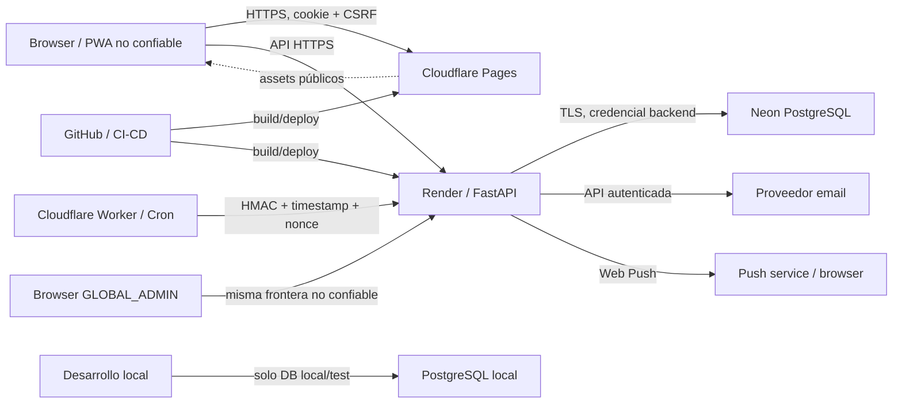

# Modelo de amenazas de LifeManager V2.0.0

## 1. Estado, alcance y método

Documento vigente desde Stage 2.1. Modela amenazas de la arquitectura objetivo V2 y registra evidencia del repositorio en HEAD `4b3f1e8`. No implica que los controles planificados ya estén implementados. Las fuentes autoritativas son `Functional-V2.md`, `NonFunctional.md`, `V2-Architecture-Baseline.md`, `Permissions.md`, `V2-Target-Data-Model.md`, `V2-Contract-Status.md` y ADR-008–012.

El análisis usa STRIDE como lista de comprobación, separación por activos/fronteras y una matriz de riesgos. No se realizaron pruebas ofensivas ni accesos a producción.

### Escala

- **CRITICAL:** compromiso directo y razonablemente explotable de administración global, secretos activos o datos privados de múltiples usuarios; exige detener el avance.
- **HIGH:** acceso cross-user/Workspace, toma de cuenta, pérdida grave de integridad o reset destructivo con precondiciones alcanzables.
- **MEDIUM:** abuso localizado, filtración limitada, degradación o control dependiente de otra vulnerabilidad.
- **LOW:** impacto reducido, hardening o riesgo operacional de baja probabilidad.

## 2. Objetivos de seguridad

| Propiedad | Objetivo |
|---|---|
| Confidencialidad | No exponer cuenta, membresía, Tasks, Pending Items, Projects/Stages, Activities, calendario, notificaciones, tokens ni secretos fuera de su autorización. |
| Integridad | Proteger asignaciones, progreso e historia, pesos, propiedad, privacidad, estados de cuenta, identidad de notificaciones y schedules. |
| Disponibilidad | Mantener login, recuperación, aplicación y jobs con límites de abuso, reintentos seguros y recuperación operativa. |
| Autenticidad | Vincular cada acción a una cuenta ACTIVE y cada acción interna a un emisor verificable. |
| Autorización | Separar GLOBAL_ADMIN, Propietario, Miembro, Organizador, Responsable y Participante; denegar por defecto. |
| Privacidad | Aplicar visibilidad de calendario antes de serializar y minimizar datos incluso para usuarios legítimos. |
| Trazabilidad | Conservar actores y eventos relevantes sin registrar secretos o cuerpos sensibles. |

## 3. Actores

- Persona de Internet no autenticada, bot, atacante de fuerza bruta o credential stuffing.
- Persona usuaria legítima, maliciosa o con navegador/sesión comprometidos.
- Miembro o Propietario malicioso de un Shared Workspace.
- GLOBAL_ADMIN legítimo o con sesión comprometida.
- Atacante con correo comprometido, bundle frontend, código fuente o secreto filtrado.
- Dependencia o actor malicioso de supply chain.
- Operador/proveedor comprometido en Cloudflare, Render, Neon, correo, Web Push o GitHub.
- Desarrollador u operador que comete un error accidental.

Ningún actor autenticado se considera confiable para validar IDs, scopes, roles, estados o campos derivados.

## 4. Fronteras de confianza y flujos

Cada salto entre navegador, proveedor estático, API, base, scheduler y proveedores externos exige autenticación propia, TLS, minimización y logging redactado. El service worker y el frontend son código público: todo secreto enviado al browser debe considerarse expuesto.

## 5. Inventario de activos

| Activo | Sensibilidad | Almacenamiento esperado | Acceso permitido | Exposición / modificación |
|---|---|---|---|---|
| Hashes de contraseña | CRITICAL | Neon `users.hashed_password` | servicio de identidad | cracking offline / toma de cuenta |
| Clave de sesión/JWT | CRITICAL | secreto Render | proceso backend | forja total de sesión |
| Cookies y CSRF | HIGH | browser, memoria/cookies | browser y backend correspondiente | robo/replay o CSRF |
| `DATABASE_URL` | CRITICAL | secreto Render/local ignorado | backend/operador | lectura o destrucción de datos |
| Digests de account actions | HIGH | Neon | servicio de identidad | replay si el token crudo también se filtra |
| Secreto de correo/Turnstile | HIGH | secreto backend | integración concreta | spam, bypass anti-bot |
| VAPID private key | HIGH | secreto backend | push sender | push fraudulento |
| Push subscriptions | HIGH | Neon, campos cifrados | dueño y sender mínimo | tracking, endpoint abuse |
| Secreto HMAC scheduler | CRITICAL | Worker y backend | job caller/verifier | ejecución interna forjada |
| Datos Workspace | HIGH | Neon | miembros ACTIVE autorizados | privacidad e integridad cross-user |
| Historiales | HIGH | Neon | scopes autorizados, APIs read-only | falsificación o pérdida de auditoría |
| Calendario/privacidad | HIGH | Neon + respuestas mínimas | política por membership | exposición de hábitos/ubicación |
| Notificaciones | MEDIUM/HIGH | Neon/browser/push | destinatario | fuga en lock screen o deep-link injection |
| `GLOBAL_ADMIN` | CRITICAL | `users.global_role` | rutas de plataforma | escalamiento vertical |
| Tokens CI/deploy | CRITICAL | GitHub/proveedores | CI y operadores mínimos | supply-chain/deploy compromise |
| Backups | CRITICAL | almacenamiento separado | operadores mínimos | pérdida o exposición total |

## 6. Superficie de ataque

### Pública

- Assets, manifest, iconos y service worker PWA.
- Registro, login, verificación, recovery y reset futuros.
- `/health`; `/ready` futuro con respuesta mínima.
- CORS, headers, OpenAPI y manejo de errores.

### Autenticada

- APIs globales `/api/v2/me`, Inicio, Revisión, Mi calendario y notifications.
- Recursos `/api/v2/workspaces/{workspace_id}/...`.
- Reportes, bulk actions, recurrence y comparison de disponibilidad.
- Push subscriptions y reminder preferences.

### Administración e interna

- Aprobación/rechazo y account management GLOBAL_ADMIN.
- Jobs de reminders/deliveries firmados; migraciones y conectividad DB.
- Proveedores de correo, push y Turnstile.

### Desarrollo y supply chain

- GitHub, branches/PR, npm/pip, lockfiles, Vite/PWA build, source maps, logs y secrets de deploy.
- Scripts Alembic destructivos y bases locales.

El router actual sigue siendo V1 y está temporalmente roto por símbolos retirados; no constituye el contrato de seguridad V2.

## 7. Amenazas de autenticación y cuenta

- Credential stuffing, spraying y brute force: respuesta uniforme, Argon2, rate limit por IP+cuenta, backoff y Turnstile escalonado.
- Enumeración: registro/recovery/resend con mensajes y tiempos suficientemente neutrales.
- Robo/fijación/replay de sesión: JWT corto en cookie `HttpOnly; Secure; SameSite`, rotación al autenticar/cambiar contraseña, logout server-aware cuando se concrete revocación y `/me` revalida cuenta ACTIVE.
- CSRF: Origin exacto, cookie double-submit ligada por digest al JWT y header obligatorio en métodos unsafe.
- Deshabilitación/cambio de contraseña: invalidar sesiones mediante versión/epoch de seguridad o registro server-side aprobado en Stage 2.8.
- Verificación/reset: token aleatorio de alta entropía, digest DB, expiración, propósito, single-use atómico y revocación de tokens previos.
- Aprobación: transición de estados server-side con locks y evento de auditoría; no confiar en body/global role frontend.

Evidencia actual: Argon2 y validación JWT existen en V1, pero el token se persiste en `localStorage`; V2 debe reemplazarlo, no adaptarlo como arquitectura final.

## 8. Autorización, IDOR y GLOBAL_ADMIN

Todo endpoint scoped debe:

1. obtener identidad desde la sesión;
2. validar cuenta ACTIVE;
3. resolver `workspace_id` del path y membership ACTIVE;
4. consultar recurso mediante `id + workspace_id`;
5. aplicar permiso funcional y locking;
6. validar toda persona asignada mediante membership ACTIVE del mismo Workspace;
7. derivar actor, owner, recipient, timestamps y rol global en servidor.

Un miembro válido recibe 404 tanto para ID inexistente como foreign Workspace; falta de membership produce 403. Reportes y vistas globales derivan scopes desde la DB, nunca desde listas del cliente.

GLOBAL_ADMIN solo administra cuentas/plataforma. No hereda acceso al contenido privado. `global_role` nunca aparece en DTOs ordinarios y las rutas admin vuelven a consultarlo en servidor.

## 9. Workspaces, invitaciones y lifecycle

- Invitaciones: email normalizado, token single-use, destinatario vinculado, expiración, rate limit, unicidad lógica y aceptación bajo lock.
- Propiedad: `owner_user_id` es única autoridad; transferencia bloquea Workspace y memberships; nunca se retira al owner sin transferencia.
- LEFT/REMOVED: cortar acceso inmediatamente; invalidar caches; preservar filas históricas y definir acceso posterior de forma explícita.
- Asignación/remoción concurrente: locks determinísticos, `lock_version`, transacción atómica y FKs compuestas como última frontera.
- Personal Workspace: creación server-side y unicidad DB; body no puede elegir owner o kind privilegiado.

## 10. Tasks, Pending Items y Projects

- Mass assignment: DTOs `extra='forbid'`; actor, scope, history metadata y campos derivados no escribibles.
- Progreso/pesos: checks DB más validación semántica; operaciones batch atómicas y acotadas.
- Optimistic concurrency: `expected_lock_version` obligatorio y UPDATE condicional; replay stale produce 409.
- Recurrencia: rango finito, arrays únicos/ranged, límite técnico configurable, cálculo antes de insertar, unicidad DB e idempotency key.
- Historial: sin endpoints genéricos de update/delete; inserción en la misma transacción que current state; actor derivado.
- Bulk notifications: una notificación lógica por destinatario/evento con dedup key.

## 11. Activities y privacidad de calendario

La privacidad se aplica en consulta/proyección antes de serializar:

- `SHOW_DETAILS`: solo detalle permitido.
- `AVAILABILITY_ONLY`: intervalos sin Activity ID, título, categoría, participantes ni deep link.
- `HIDE`: ninguna fila o intervalo subyacente.

El backend no devuelve detalles para que el frontend los oculte. Organizer se deriva/valida; participants pertenecen al mismo Workspace; solo Organizer modifica/cancela globalmente. Al retirar participante se deshabilita reminder y se corta visibilidad. Comparaciones usan rangos acotados y resultados mínimos para reducir inferencias.

## 12. Notifications, Push y scheduler

- Recipient/type/deep link se derivan o allowlistan; texto plano, payload tipado, tamaño limitado y sin HTML.
- Deep links deben ser paths internos allowlisted, nunca esquemas/hosts arbitrarios.
- Push cifra endpoint/p256dh/auth, nunca los devuelve completos y minimiza contenido visible en lock screen.
- Subscription mutations exigen ownership; endpoints inválidos se desactivan y deliveries son idempotentes.
- Jobs internos no usan sesión de usuario ni OpenAPI público. Firma HMAC sobre método/path/body digest/timestamp/nonce, comparación constante, ventana corta y nonce single-use.
- Claims atómicos, dedup keys, límites por lote y backoff evitan duplicados/retry storms.

## 13. Email y account actions

Solicitudes son neutrales y rate-limited por IP/email/cuenta. El token crudo solo viaja por el canal de correo; DB conserva digest. Consumo bloquea la fila y marca consumed/revoked atómicamente. Cambiar email o contraseña revoca tokens incompatibles. Los enlaces no deben aparecer completos en logs, analytics, referrer ni respuestas.

Un correo comprometido queda fuera del control completo del producto; se mitiga con expiración corta, avisos y futura gestión de sesiones, no se considera al email prueba perpetua de identidad.

## 14. Input, inyección y errores

- SQLAlchemy parametrizado; raw SQL solo con constantes controladas. Ningún ID/nombre de tabla desde request se interpola.
- Pydantic v2 con límites, `extra='forbid'`, enums y UUIDs; page/range/batch caps server-side.
- React escapa texto por defecto; no se encontró `dangerouslySetInnerHTML`. CSP limita impacto residual.
- Unicode: NFC/casefold consistente, longitud después de normalizar y unicidad DB.
- No hay superficie de archivos/subprocess actual; cualquier incorporación exige análisis de traversal/command injection.
- Error V2 uniforme: sin SQL, constraint, stack, host, token o valores sensibles; request ID opaco.

## 15. Browser, PWA y frontend

- El bundle, variables `VITE_*`, requests y DevTools son públicos. Nunca contienen secretos.
- V2 usa cookie HttpOnly y no `localStorage`; el token Bearer V1 actual es un riesgo HIGH ante XSS.
- TanStack Query se limpia en logout/401 y debe separar cache keys por identidad/Workspace.
- Service worker cachea únicamente shell/assets versionados; no API, respuestas autenticadas ni páginas con datos personales. Logout debe limpiar caches sensibles si llegaran a existir.
- Definir CSP, frame-ancestors, nosniff, Referrer-Policy y Permissions-Policy en Cloudflare/Render.
- Deep links reautorizan al cargar; history y errores no incorporan secretos.

## 16. Secretos y logging

### Evidencia

- Árbol actual: no se encontraron claves privadas ni tokens GitHub; los matches son placeholders explícitos o tests.
- Historia Git: `backend/alembic.ini` contiene en una revisión inicial una URL PostgreSQL histórica con credencial de aspecto real y hostname local. No está en el archivo vigente y no se verificó contra ningún sistema. Debe considerarse expuesta, confirmar que fue desechable/no reutilizada o rotarla, y decidir por separado si procede limpiar historia.
- `.env` está ignorado; solo `.env.example` está tracked.

La caracterización completa, el inventario frontend/cloud y las acciones manuales se mantienen en [`V2-Secrets-and-Exposure-Audit.md`](V2-Secrets-and-Exposure-Audit.md).

### Reglas de redacción

Nunca registrar Authorization/cookies, passwords, token crudo/digest, recovery link, CSRF, HMAC, DATABASE_URL, email completo, push endpoint/key, payload sensible o request body de auth. SQL echo debe estar desactivado en producción. Logs estructurados usan request ID, event code, actor ID cuando sea necesario y resultado; stack trace solo server-side con acceso restringido.

## 17. Database, migraciones y operación

- Credencial de aplicación con privilegios mínimos; migrator separado a evaluar. TLS y backups cifrados/restaurables.
- FKs compuestas/checks/triggers ofrecen defensa final; authorization sigue siendo service-layer.
- Evaluar RLS en un prototipo posterior para tablas Workspace como defensa en profundidad. No adoptarlo hasta demostrar compatibilidad con jobs, admin sin acceso privado, histories, rendimiento y migraciones.
- El reset `e4f5a6b7c8d9` exige opt-in, entorno, loopback, nombre allowlisted y forma V1 exacta; no usa `DROP SCHEMA` ni identificadores de entorno.
- Riesgo residual: un túnel/proxy loopback o entorno falsificado por un operador con credenciales puede eludir la intención local. Prohibir la revisión en pipelines/productivo y retirarla del camino operativo después del bootstrap V2.
- Ningún reset destructivo es válido después de datos reales; usar migraciones preservadoras y backups verificados.

## 18. Abuso, límites y disponibilidad

Requieren throttling compuesto:

| Superficie | Dimensiones mínimas |
|---|---|
| Login/registro/Turnstile | IP, cuenta/email, endpoint |
| Verification/recovery/reset | IP, cuenta/email, token purpose |
| Invitaciones | actor, Workspace, recipient, IP |
| Reports/Calendar comparison | user, Workspace, rango, endpoint |
| Push subscription | user, endpoint hash, IP |
| Jobs internos | caller key, job, nonce |

Caps server-side: recurrence expected count/range; IDs por batch; page_size; rangos de report/calendar; ProjectStages; histories/feed; notification fan-out y job claim size. Límites concretos se calibran con carga, se configuran y retornan errores claros; no son reglas permanentes del dominio.

## 19. Supply chain y cloud

- Backend está completamente pinneado; frontend tiene lockfile v3, pero manifiesto usa rangos `^`. Instalar en CI con `npm ci` y hashes/constraints equivalentes para Python.
- No existen workflows GitHub actuales: antes de CI, usar actions fijadas por SHA, permisos mínimos, environments protegidos, OIDC cuando sea posible y secret scanning/dependency review.
- Revisar scripts de paquete; actualmente solo dev/build/typecheck/lint/test/preview.
- Cloudflare preview no debe recibir secretos backend; `VITE_*` es público. Desactivar source maps públicos o revisar contenido.
- Render/Neon/Cloudflare/GitHub: MFA, menor privilegio, tokens separados/rotables, logs restringidos, branches protegidas y alertas.
- Probar restore de Neon y documentar RPO/RTO; backups independientes para datos familiares reales.

## 20. Matriz de requisitos de seguridad

| ID | Activo | Amenaza / camino | Riesgo | Control actual | Control V2 requerido | Etapa | Verificación |
|---|---|---|---|---|---|---|---|
| AUTH-001 | Cuenta | Stuffing/brute force en login | HIGH | Argon2 V1 | neutralidad, rate limit, Turnstile/backoff | 2.7–2.10 | HTTP multi-IP/cuenta |
| AUTH-002 | Sesión | Robo JWT desde localStorage por XSS | HIGH | limpieza 401/logout V1 | cookie HttpOnly/Secure + CSP | 2.8, 2.12 | browser/XSS/cookie flags |
| AUTH-003 | Sesión | CSRF sobre cookie V2 | HIGH | no aplica a Bearer V1 | double-submit, Origin exacto | 2.8 | CORS/CSRF HTTP real |
| AUTH-004 | Cuenta | Sesión stale tras disable/password change | HIGH | `/me` V1 parcial | revalidación/epoch/revocación | 2.3, 2.8 | disable-session regression |
| ACT-001 | Tokens | Guess/replay verification/reset | HIGH | verificación: 256-bit entropy, SHA-256 digest, TTL, purpose y single-use lock | completar los mismos controles para recovery | 2.6 | concurrency/replay por purpose |
| AUTHZ-001 | Workspace | IDOR con UUID foreign | CRITICAL | FKs estructurales | membership + scoped SQL + 404 masking | Workspace/verticales | matriz cross-user |
| AUTHZ-002 | Cuenta | Mass assignment de actor/role/scope | CRITICAL | modelo restringe algunos valores | DTO forbid + server-derived fields | 2.11/verticales | forged-field tests |
| ADMIN-001 | Plataforma | Forjar GLOBAL_ADMIN | CRITICAL | check/unique DB; dependency/DTO y pruebas negativas Stage 2.3–2.4 | completar bootstrap operativo y gates | 2.13 | ordinary→admin denial; disabled admin denial; sin membership implícita |
| ADMIN-002 | Privacidad | Admin lee contenido privado | HIGH | separación física | prohibición explícita y tests | 2.12/Workspaces | admin privacy matrix |
| WS-001 | Propiedad | Hijack/remoción de owner | HIGH | trigger diferible | locks + transfer action | Workspace stage | race/rollback tests |
| WS-002 | Invitación | Aceptar invitación ajena/replay | HIGH | digest/lifecycle model | recipient binding, single-use, locks | Workspace stage | multiuser/concurrency |
| WS-003 | Membresía | Acceso stale tras LEFT/REMOVED | HIGH | lifecycle persistido | ACTIVE en cada request/cache purge | Workspace stage | removal race |
| DOM-001 | Asignación | Responsable/Líder foreign Workspace | HIGH | composite FK | ACTIVE check under lock | verticales | forged assignment |
| DOM-002 | Historia | Actor/content forged o borrado | HIGH | tablas append-only shape | no CRUD genérico, actor server-side | verticales | API+DB history tests |
| DOM-003 | Concurrencia | Bypass/replay lock_version | HIGH | checks/version fields | conditional updates/batch preflight | verticales | concurrent mutations |
| REC-001 | Recursos | Recurrence enorme/duplicada | MEDIUM | finite/check/unique | configurable cap + idempotency | Tasks/Calendar | property/load tests |
| CAL-001 | Calendario | AVAILABILITY_ONLY filtra detalles | CRITICAL | privacy en membership | projection previa a serialization | Calendar stage | response-field matrix |
| CAL-002 | Actividad | Organizer/participant forged | HIGH | composite FK | organizer permissions + ACTIVE | Calendar stage | multiuser IDOR |
| CAL-003 | Privacidad | Inferencia por rangos/comparison | MEDIUM | diseño mínimo | caps, agregación mínima, throttling | Calendar stage | abuse/privacy tests |
| NOTIF-001 | Browser | XSS/deep-link/payload injection | HIGH | JSON/text fields | allowlists, escaping, CSP, size caps | Notifications | malicious payload tests |
| NOTIF-002 | Push | Subscription/recipient theft | HIGH | ownership columns/ciphertext | scoped API + encryption/key rotation | Notifications | cross-user push tests |
| NOTIF-003 | Disponibilidad | Amplificación/duplicados | MEDIUM | dedup index | one logical event, caps, retry-safe | Notifications | concurrency/fan-out |
| JOB-001 | Jobs | Endpoint público/replay/HMAC leak | CRITICAL | diseño documental | HMAC+timestamp+nonce, hidden namespace | Scheduler stage | signature/replay suite |
| INPUT-001 | DB/browser | SQLi/XSS/mass assignment | HIGH | ORM/React escaping | validation, CSP, DTO forbid | 2.11–2.12 | payload corpus |
| SEC-001 | Secretos | Credencial histórica reutilizada | HIGH | retirada del árbol; hostname histórico local | confirmar no reutilización o rotar; history policy separada | 2.2/2.13 | secret scan/rotation record |
| LOG-001 | Secretos/PII | Logs contienen auth/recovery/SQL | HIGH | SQL echo configurable | redaction + structured logging | 2.11/final hardening | log-capture tests |
| DB-001 | Datos | Reset destructivo productivo | CRITICAL | guardas e4f5 | excluir pipeline, retire after bootstrap | final migration gate | refusal/schema-unchanged |
| DB-002 | Datos | Credencial DB amplia o filtrada | CRITICAL | secrets backend-only | least privilege, rotation, TLS/backups | 2.2/cloud gate | privilege/restore audit |
| SC-001 | Build | Dependencia/action comprometida | HIGH | pins backend, npm lock | `npm ci`, SHA actions, SCA/SAST | 2.12/final hardening | CI policy/scans |
| DOS-001 | Servicio | Reports/bulk/history agotan recursos | MEDIUM | algunos caps V1 | caps/rate/timeouts/query budgets | verticales | load/boundary tests |

## 21. Abusos prioritarios

| Caso | Ataque | Controles requeridos | Resultado seguro |
|---|---|---|---|
| Pending ajeno | usar UUID de otro Workspace | membership + `id,workspace_id` + 404 | ningún dato ni diferencia observable |
| Calendario oculto | pedir detail/comparison directamente | privacy projection backend | HIDE sin intervalos; availability sin detalle |
| Auto-admin | modificar frontend/body/global role | DTO excluye + dependency DB | 403/404, evento de seguridad |
| Task foreign | enviar responsable externo | lock membership ACTIVE + composite FK | 404/422 seguro, sin fila parcial |
| Robar/resetear cuenta | enumeration, token replay | neutralidad, digest, TTL, lock, rate | respuesta neutral y token single-use |
| Secret en bundle | usar `VITE_*` o source map | build scan, variables públicas solo | build falla; secreto nunca publicado |
| Reset productivo | falsear flags/target | loopback+shape+opt-in+pipeline ban | aborta antes de DDL |
| Scheduler forjado | replay/firma inválida | HMAC, timestamp, nonce | 401/403 uniforme, ningún job |
| Spam notification | repetir/bulk fan-out | dedup, caps, rate, idempotencia | una notificación lógica acotada |
| Alterar historia | PATCH/DELETE o actor forged | sin rutas mutables + transacción | 404/405/422; historia intacta |

## 22. Backlog de pruebas

- Auth: neutralidad, password corpus, token expiry/replay/concurrency, session fixation, disable/password-change invalidation.
- HTTP browser: cookies, SameSite/Secure/HttpOnly, CSRF, Origin/CORS, CSP y cache/service worker.
- Authorization: matriz usuario × membership × recurso × operación; IDOR y forged fields.
- GLOBAL_ADMIN: rutas administrativas y prueba negativa de contenido privado.
- Workspaces: invitation replay, owner transfer/removal races y cache invalidation.
- Calendar: SHOW_DETAILS/AVAILABILITY_ONLY/HIDE a nivel de campos y timing.
- Domain: optimistic concurrency, atomic batches, history append-only y recurrence property tests.
- Notifications/jobs: recipient ownership, deep-link allowlist, XSS payloads, dedup, HMAC replay y retry storms.
- Input: SQLi/XSS/Unicode/oversize/parameter pollution y límites de ranges/pages.
- Operations: secret scan de árbol/historia/build, dependency audit, migration refusal, backup restore y logging redaction.

## 23. Mapeo de etapas

- **2.2:** inventario de secretos, credencial histórica, bundle/storage y cloud configuration; la acción manual abierta bloquea 2.13.
- **2.3:** global roles, account state y separación admin/private content.
- **2.4:** registro/aprobación y anti-mass-assignment.
- **2.5:** verificación email y tokens single-use.
- **2.6:** recovery/reset neutral y revocación.
- **2.7:** policy y hashing.
- **2.8:** cookies, CSRF, sesión/revocación.
- **2.9:** rate limiting y fuerza bruta.
- **2.10:** Turnstile.
- **2.11:** validación, envelope, logging/redaction.
- **2.12:** suite de seguridad HTTP/DB/browser y scans.
- **2.13:** gate de identidad/seguridad.
- Stages posteriores de Workspace/verticales implementan autorización funcional; Calendar y Notifications implementan privacidad/jobs; hardening final cubre CSP, CI/cloud, backups y supply chain.

## 24. Supuestos y no objetivos

Supuestos: HTTPS en producción; browser inspeccionable y no confiable; credenciales DB solo backend; email puede retrasarse/comprometerse; push puede verse en lock screen; GLOBAL_ADMIN es cuenta de máximo riesgo; proveedores aplican controles básicos pero pueden fallar.

No objetivos: defender un OS totalmente comprometido, SIEM empresarial, HSM, detección avanzada, mitigación DDoS superior a proveedor/rate limits o cifrado end-to-end de todo contenido. Sí siguen siendo obligatorios aislamiento, autorización, TLS, secretos seguros, backups y privacidad.

## 25. Resultado de Stage 2.1

No se encontró una vulnerabilidad CRITICAL activa confirmada. Stage 2.2 caracterizó la credencial histórica como local y retirada del árbol actual, pero exige confirmar que fue desechable/no reutilizada o completar rotación; el gate 2.13 permanece bloqueado. Los riesgos CRITICAL/HIGH cuentan con controles y etapas de verificación asignados. Stage 2.1 queda **Completado** como threat model; no como implementación de controles.
